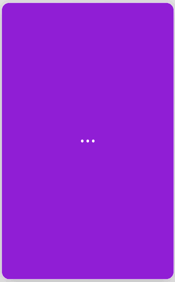

**iOS 10+**

Context menu animated from the ellipsis symbol.

## Preview



*Recording causes background glitch.*

## Usage

```swift
let topButton = UIButton(type: .system)
topButton.tintColor = .white
topButton.setImage(#imageLiteral(resourceName: "calendar"), for: .normal)

let middleButton = UIButton(type: .system)
middleButton.tintColor = .white
middleButton.setImage(#imageLiteral(resourceName: "bookmark"), for: .normal)

let bottomButton = UIButton(type: .system)
bottomButton.tintColor = .white
bottomButton.setImage(#imageLiteral(resourceName: "plus"), for: .normal)

let dotsMenu = DotsContextMenu(topButton: topButton, middleButton: middleButton, bottomButton: bottomButton)
view.addSubview(dotsMenu)
```

## Properties

```swift
var isReversed = false

var width: CGFloat = 44

var dotRadius: CGFloat = 3

var closeAfterDelay: TimeInterval = 5
```

## Methods

```swift
func open()

func close()
```

## Todo

- [ ] Add to Carthage & Cocoapods
